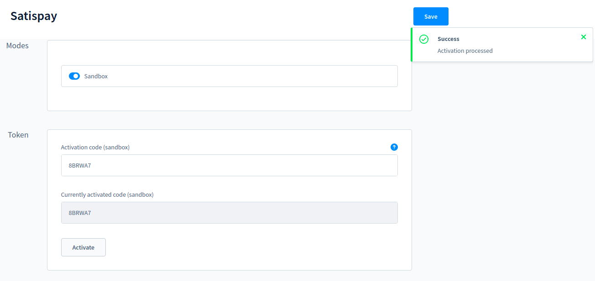

# Satispay payment

Satispay plugin for Shopware 6 ecommerce

## Requirements

- Shopware 6.1.* or 6.2.* or 6.3.* or 6.4.* or 6.5.* or 6.6.*
- Satispay payment method is allowed only for EURO transactions.

## Installation

### Via composer

Use the composer require command to add it to your ecommerce

For Shopware versions lower than Shopware 6.5:
```bash
composer require satispay/shopware6-plugin:1.2.0
```
For Shopware 6.5:
```bash
composer require satispay/shopware6-plugin:2.2.0
```
For Shopware 6.6 and over:
```bash
composer require satispay/shopware6-plugin
```
Then you have to install and activate it

```bash
bin/console plugin:refresh
bin/console plugin:install Satispay
bin/console plugin:activate Satispay
```

After installation, a new [rule](https://docs.shopware.com/en/shopware-6-en/settings/rules) will be added called **Currency Euro**. This rule is set as [availability rule](https://docs.shopware.com/en/shopware-6-en/settings/Paymentmethods#availability-rule) for Satispay payment method.

## Configuration

### Activate Satispay Token

1. Log in as admin user
2. Access Settings > System > Plugins for Shopware version lower than 6.4.x or access Extensions > My Extensions for Shopware version equal/higher than 6.4.x

   
3. Select config button for Satispay payment plugin to access its settings

   
4. Select if you want to use sandbox mode through the checkbox Sandbox (if active is blue and will run on sanbdox, not otherwise)

   
5. Insert your activation code created from your satispay account dashboard (Negozi Online -> Crea codice di attivazione)

   
6. Click Save button to save current settings

   
7. Click Activate button

   

In case of success, you see in the Currently activated code your activation code.
In case of error, you'll receive an error code for Satispay support to identify the issue.

If you **empty the token activation** and click **activate**,
it will **delete current activation values** and you will need a new token to **activate your connection** to satispay.

   

### Enable Satispay Payment method

1. Select the corresponding sales channel where you want to activate satispay payment method
2. Open the dropdown Payment methods from Payment and shipping settings and select Satispay payment

   
3. Click Save button to save current settings

### Extra settings (optional)

Extra settings are available in the admin panel in Settings > Shop > Payment.


To view or change them select the action button and click edit.


### Refund payment

1. Open the order you want to create the refund for from the orders grid.

   _**Only the orders that have the payment status paid, refunded or refunded partially can be refunded.**_
2. Select the **Satispay Tab**  _visible only if the order was paid with satispay_.


3. Click **Make a Refund** button
4. Insert the amount to refund and confirm clicking **Perform refund** button


In case of error, you'll receive an error code for Satispay support to identify the issue.


## Payment Flow


* In 6.1 the payment status after the get payment status will stay in **OPEN** instead of **IN PROGRESS**.

## Scheduled task to finalize unhandled transactions


In the plugin configuration there is a value to enable a scheduled task that runs every 4 hours and finalizes
Satispay transactions for the latest hours specified in the Time Frame field (excluding the last hour so that these
payments follow the default flow and wait for the callback).

## Tested on

- 6.1
- 6.2
- 6.3
- 6.4
- 6.5
- 6.6

## Contributing

Pull requests are welcome. For major changes, please open an issue first to discuss what you would like to change.

## License

This project uses the [MIT LICENSE](LICENSE)
